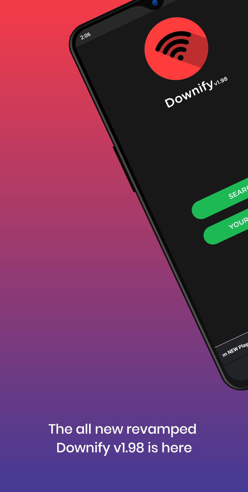
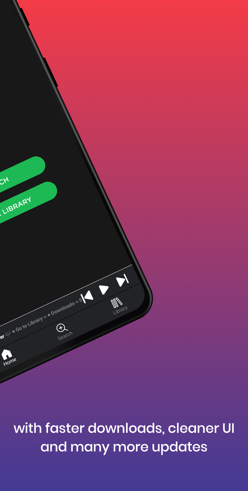
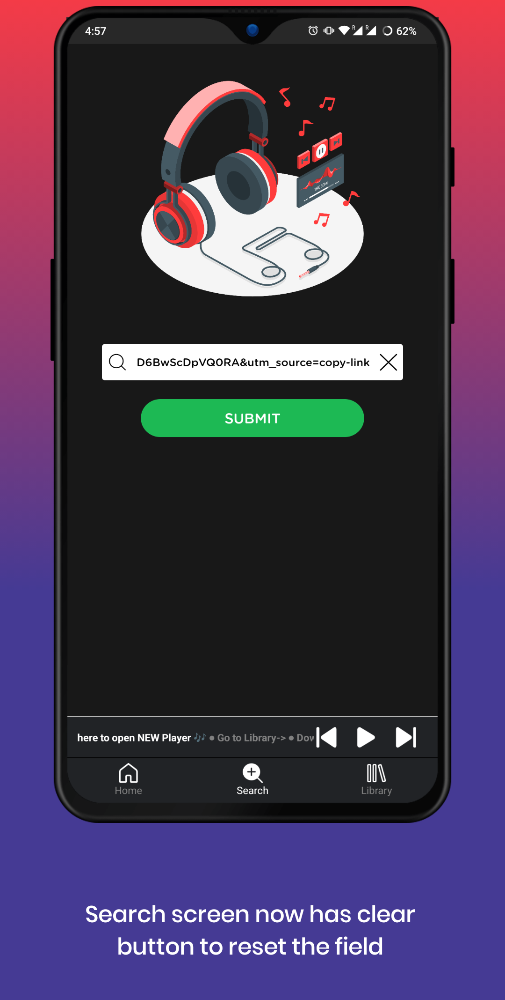
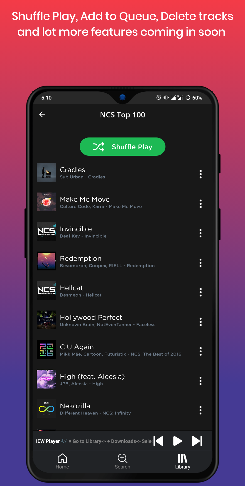

<h1><strong>Downify</strong></h1>
<h2 >
    Downify let's you enjoy music on-the-go, even when you are offline.
    </h2>

<a href="https://play.google.com/store/apps/details?id=com.sam.downify" >
Get it on Playstore
</a>
 

 

# 🎯 Goal

<h3>
Downify wants to make sure that, no one is deprived of music on that long road trip or airplane when there is no Internet Connection.
You can download your Spotify playlists/albums in advance and enjoy music everywhere. And that too without annoying ads.
</h3>

# Screenshots

    
    
    
    
    

 

# Changelog

- [**1.80**](https://github.com/samadritsarkar2/spotifyDown/tree/version1.80)

  - Removed the Google AdMob Package
  - Added ironSource Ads
  - Removed Donations
  - Fixed bugs arising out of updated sdk version

- [**1.75**](https://github.com/samadritsarkar2/spotifyDown/tree/version1.75)

  - Shuffle Play 🔀
  - Tracks can now be deleted within the app 🚮
  - Tracks are now arranged according to the playlist
  - Tracks downloaded in previous versions will be categorized in 'Unorganized'
  - Minor Banner Ads may be there
  - Downloading optimized and etc.

- [**v1.5**](https://github.com/samadritsarkar2/spotifyDown/tree/version1.5)
  - Added Music Player
  - Added Notification Bar Music controller
  - Supports Spotify Albums now, alongside Playlists
  - Added Downloads Page
  - Added a Mini player component ( Will add more features to it via OTA Updates )
  - Support for OTA Updates
  - UI Changes
  - For more, see [CHANGELOG](/CHANGELOG.MD)
     
     
- [**v1**](https://github.com/samadritsarkar2/spotifyDown/tree/version1) (Intial Release)
  - Supports Spotify Playlist
  - Playing a downloaded a song, launches Music player Intent.
  - Download All functionality
  - Save the playlist for later

# How it works?

It uses <a href="https://developer.spotify.com/">Spotify offical API</a> to fetch the tracks and Youtube(youtube-dl) to download the tracks. All that happens in server side and the app just downloads the mp3 file for later.

P.S:- ~~I have written a lot of Bad code, I will start improving the app and code soon.~~
I improved the code a little bit and the overall code structure. Will work on it soon.

# Tech Stack

- React Native
- Node Js (Backend Server) ~~[Will make the backend code public soon]~~
- Firebase (For Analytics)

# Known Issues

- With the latest update, a song can be downloaded only once and hence it can be present in only one playlist. This will be solved in the upcoming version as we go into more complicated database system.
- ~~While a track(/s) is getting downloaded from a particular playlist, if user exists the screen or another playlist is loaded, then the download gets cancelled.~~
- Few playlist may give error unexpectedly.
- Due to youtube policies, few songs are not downloadable. This is because some videos are regionally restriced or so. [See these limitations](https://github.com/fent/node-ytdl-core#limitations)
- Youtube server gives `429 error`.
- Downloads wrong tracks
- If you encounter anything else, feel free to report an issue or DM me. I will definetly work on it.

# Upcoming Features

- [x] In-app Music Player
- [x] Support for Spotify Albums. ([#2](https://github.com/samadritsarkar2/spotifyDown/issues/2))
- [ ] In-app music controller such as, queue, seek bar etc.
- [ ] Optimized Download functionality
- [ ] Spotify Login to fetch playlists
- [x] Suggestions are always welcome.

# For Legal Purposes

    You can mail me at **samadrit.sarkar2@gmail.com** or DM me.
