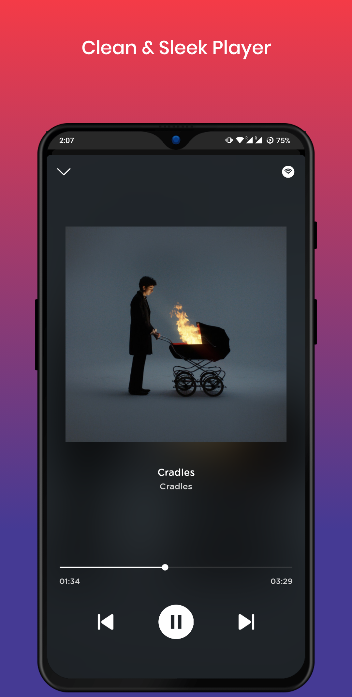

# Spotify Downloader

An app that let's you download public Spotify playlists, illegally ofcourse XD 
 
It uses <a href="https://developer.spotify.com/">Spotify offical API</a> to fetch the tracks and Youtube(youtube-dl) to download the tracks. 

P.S:- I have written a lot of Bad code, I will start improving the app and code soon.

## Screenshots 

    
    
    
    
    

## Tech Stack
    
    - React Native
    - Node Js (Backend Server) [Will make the backend code public soon]
    - Firebase (For Analytics

## Known Issues
    - Few playlist may give error unexpectedly.
    - If playlist name is too long, other components overlaps it
    - UI may break in low resolution devices(Tho I almost fixed that)
    - Downloads wrong tracks
    - If you encounter anything else, feel free to report an issue or DM me.

## Upcoming  Features 
    - In-app Music Player
    - Optimized Donload All functionality 
    - Spotify Login to fetch playlists
    - Suggestions are always welcome.

